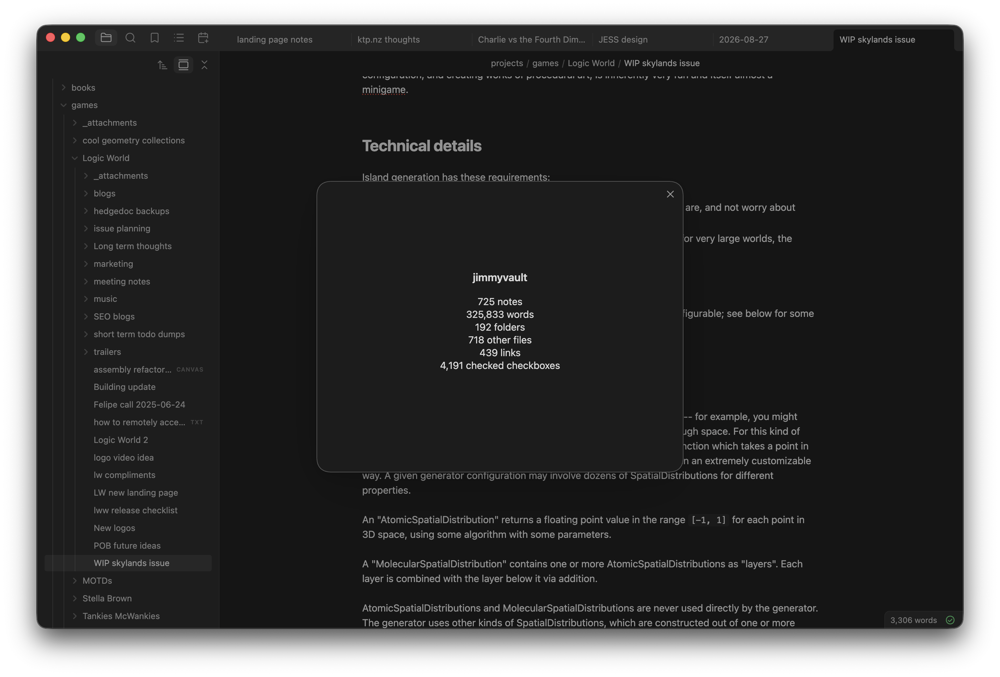
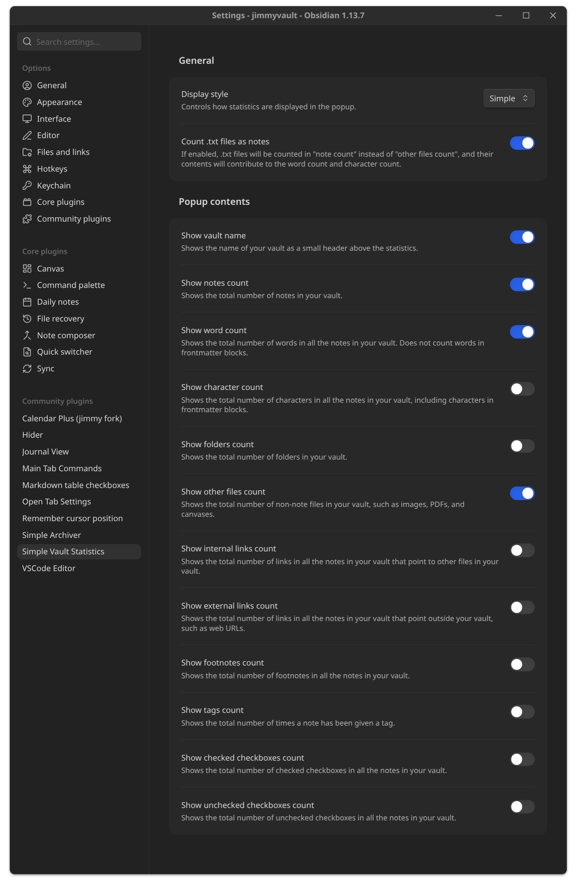
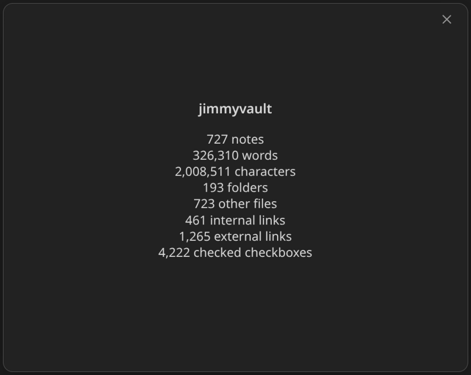
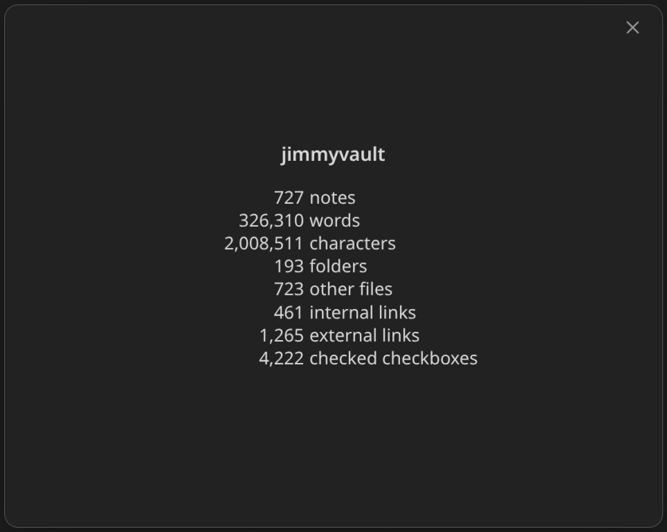
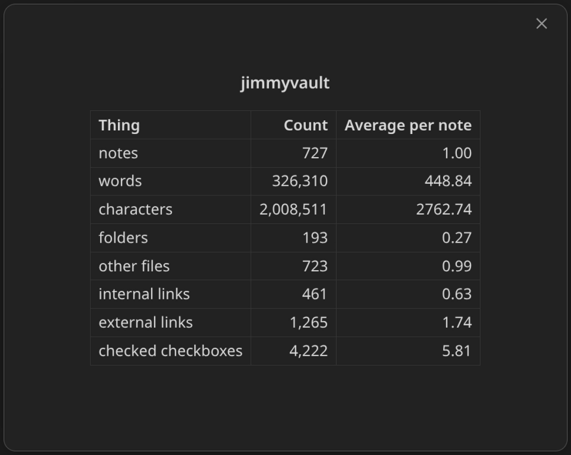

# Simple Vault Statistics

This is a plugin for [Obsidian](https://obsidian.md) that adds a simple popup with statistics about the current vault.

## Usage

After installing and enabling the plugin, you can open the popup with the button in the ribbon, or with the "Show vault statistics" command (which you can run from the command palette or by giving it a keyboard shortcut).

## Customizing

Here are all the settings available in this plugin. You can choose which statistics are shown and the style they are shown in. You can also choose to treat `.txt` files as notes.

All settings

Here's what the different display styles look like:

| Simple                                   | Aligned                                   | Table with averages per note                                   |
| ---------------------------------------- | ----------------------------------------- | -------------------------------------------------------------- |
|  |  |  |

You may edit any of the plugin's settings while the statistics popup is open. Doing so will update the popup.
